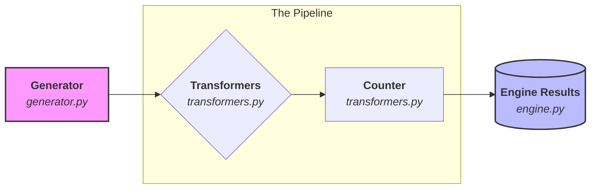

Here is a clean `README.md` that summarizes the foundation we've built. This serves as your "Project Milestone" marker so you can pick back up exactly where you left off.

---

# PermuStats: Foundation

This repository contains the core generation logic for **PermuStats**, a library designed for generating and analyzing permutations efficiently using Python generators.

## 🚀 Components

### 1. `generator.py`

Contains the `PermutationGenerator` class, which leverages Python generators to provide memory-efficient access to permutations.

* **`exhaustive(n)`**: Yields all  permutations in lexicographic order using `itertools`.
* **`sample(n, num_samples)`**: Yields a specific number of random permutations using `random.sample` (optimized C-implementation of the Fisher-Yates shuffle).

### 2. `test_generator.py`

A comprehensive test suite using `pytest` to ensure:

* Correct permutation counts for exhaustive sets.
* Requested sample sizes are met.
* Data integrity (each permutation is a valid zero-indexed set of integers from  to ).

## 🛠 Usage

To generate all permutations of size 3:

```python
from generator import PermutationGenerator

for p in PermutationGenerator.exhaustive(3):
    print(p)

```


## ✅ Status: Milestone 1 Complete

* [x] Core Generator Class
* [x] Lexicographic Generator
* [x] Random Sampling Generator
* [x] Unit Tests

---

# PermuStats: Modular Analysis

**PermuStats** is a Python library for generating and analyzing permutations. It uses a plugin-based architecture to allow for extensible mathematical transformations and statistical analysis.

## 🚀 Components

### 1. Generation (`generator.py`)

Memory-efficient generators for permutation data.

* **`exhaustive(n)`**: All  permutations in lexicographic order.
* **`sample(n, num_samples)`**: Randomly sampled permutations.

### 2. Plugin Architecture (`plugin.py`)

The project uses an Abstract Base Class (`PermuPlugin`) to ensure all analysis tools follow a consistent interface. This makes it easy to "plug and play" new mathematical transformers.

### 3. Transformers (`transformers.py`)

* **`CycleFormTransformer`**: Converts standard one-line notation (e.g., `[1, 0, 2]`) into **Canonical Cycle Form** (e.g., `[[0, 1], [2]]`). This is essential for studying the decomposition of permutations into disjoint cycles.

## 🛠 Usage

To transform a permutation into its cycle form:

```python
from transformers import CycleFormTransformer

transformer = CycleFormTransformer()
p = [1, 2, 0]
print(f"Standard: {p} -> Cycles: {transformer.process(p)}")
# Output: Standard: [1, 2, 0] -> Cycles: [[0, 1, 2]]

```

To run the test suite:

```bash
pytest test_generator.py test_plugins.py

```

## ✅ Status: Milestone 2 Complete

* [x] Core Generator Class
* [x] Abstract Plugin Interface
* [x] Cycle Form Transformer
* [x] Unit Tests for Generators & Plugins

---

That’s another milestone in the bag. With these counters, **PermuStats** is now capable of extracting specific quantitative data from the qualitative structures we built in Phase 2.

Here is the updated `README.md`, now featuring the **Analysis & Statistics** section.

---

# PermuStats: Analysis & Statistics

**PermuStats** is a modular Python library for generating, transforming, and extracting statistics from permutations. It uses a decorator-inspired plugin architecture to keep mathematical logic decoupled and testable.

## 🚀 Components

### 1. Generation (`generator.py`)

Memory-efficient generators for permutation data.

* **`exhaustive(n)`**: All  permutations in lexicographic order.
* **`sample(n, num_samples)`**: Randomly sampled permutations using `random.sample`.

### 2. Plugin Architecture (`plugin.py`)

All tools inherit from the `PermuPlugin` Abstract Base Class, ensuring a consistent `.process()` interface across the library.

### 3. Transformers & Counters (`transformers.py`)

The library separates **structural transformations** from **numerical counters**:

* **`CycleFormTransformer`**: Converts standard notation to disjoint cycles (e.g., `[1, 0, 2]` → `[[0, 1], [2]]`).
* **`FixedPointCounter`**: Returns the count of elements that map to themselves ().
* **`CycleLengthCounter`**: Takes cycle-form data and returns a list of cycle lengths (e.g., `[[0, 1], [2]]` → `[2, 1]`).

## 🛠 Usage

### Statistical Extraction

```python
from transformers import FixedPointCounter, CycleFormTransformer, CycleLengthCounter

# 1. Count Fixed Points
fp = FixedPointCounter()
print(fp.process([0, 1, 2])) # Output: 3

# 2. Get Cycle Lengths (Pipelined)
transformer = CycleFormTransformer()
cl_counter = CycleLengthCounter()

p = [1, 0, 2]
cycles = transformer.process(p)
lengths = cl_counter.process(cycles)
print(lengths) # Output: [2, 1]

```

To run the full test suite:

```bash
pytest test_generator.py test_plugins.py

```

## ✅ Status: Milestone 3 Complete

* [x] Core Generator Class
* [x] Abstract Plugin Interface
* [x] Cycle Form Transformer
* [x] **Fixed Point Counter**
* [x] **Cycle Length Counter**
* [x] Expanded Unit Tests

---

That is fantastic news. With the **Engine** in place, you’ve moved from a collection of parts to a functional machine.

I've updated the `README.md` to reflect the new "Pipeline" architecture. This version highlights how the `PermuStatsEngine` acts as the central nervous system for the whole project.

---

# PermuStats: The Pipeline Engine

**PermuStats** is a modular Python library designed for the automated generation and statistical analysis of permutations. It uses a "Pipeline" architecture to chain data through transformations and collectors.

## 🚀 Components

The PermuStats architecture follows a linear data pipeline, allowing for modular processing of permutation data.



### 1. The Engine (`engine.py`)

The **PermuStatsEngine** is the orchestrator. It wires together a generator, an optional chain of transformers, and a final counter to aggregate data across large samples.

### 2. Generation (`generator.py`)

* **`exhaustive(n)`**: Systematic lexicographic generation.
* **`sample(n, num_samples)`**: Stochastic sampling for large-scale analysis.

### 3. Transformers & Counters (`transformers.py`)

* **`CycleFormTransformer`**: Structural mapping to disjoint cycles.
* **`FixedPointCounter`**: Extraction of fixed-point counts ().
* **`CycleLengthCounter`**: Extraction of cycle lengths from transformed data.

## 🛠 Usage: Running a Pipeline

You can now build a complete analysis pipeline in just a few lines of code.

### Example: Analyzing Fixed Points for 

```python
from generator import PermutationGenerator
from transformers import FixedPointCounter
from engine import PermuStatsEngine

# 1. Setup components
gen = PermutationGenerator.exhaustive(3)
counter = FixedPointCounter()

# 2. Wire the engine
engine = PermuStatsEngine(generator=gen, counter=counter)

# 3. Run and get aggregated results
results = engine.run()
print(results) 
# Output: [3, 1, 1, 0, 0, 1]

```

### Example: Chaining Transformers

To get cycle lengths from 1,000 random samples:

```python
from transformers import CycleFormTransformer, CycleLengthCounter

engine = PermuStatsEngine(
    generator=PermutationGenerator.sample(10, 1000),
    transformers=[CycleFormTransformer()],
    counter=CycleLengthCounter()
)
results = engine.run()

```

## ✅ Status: Milestone 4 Complete

* [x] Core Generator Class
* [x] Abstract Plugin Interface
* [x] Cycle Form & Length Transformers
* [x] **Pipeline Controller (The Engine)**
* [x] Full Integration Testing

---
